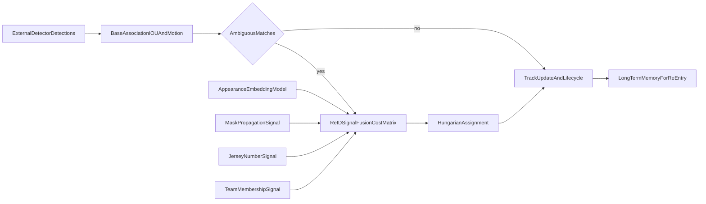

# Detector-First Basketball MOT MVP Plan

## Current Starting Point

- Repository is effectively empty; only `[/home/david/joey/README.md](/home/david/joey/README.md)` exists.
- We will treat this as a greenfield build with selective algorithm borrowing from OC-SORT / ByteTrack / DeepSORT / McByte ideas.

## Product Goal

- Build an online tracker that ingests external detections (e.g., RF-DETR) and produces stable per-player IDs with minimal ID switches, especially during clustered occlusions.
- Keep architecture modular so each re-ID signal (appearance, masks, jersey number, team) can be toggled, weighted, and benchmarked.

## Target Architecture (MVP)



## Delivery Phases (6-8 Week MVP)

1. **Phase 0 - Baseline gauntlet (benchmark first)**

- Stage and validate source materials first:
  - scored game JSON files (action timestamps/frame numbers)
  - matching high-resolution source videos
  - generated proxy videos (lower resolution/FPS) for fast iteration
- Extract standardized action-centered clips from proxy videos (initial default: 20s windows), expected to yield hundreds to ~1,000 clips.
- Run your current tracker stack (OC-SORT, ByteTrack, McByte) on the extracted internal basketball clips before building Joey tracker core.
- Produce reproducible baseline scorecards and a leaderboard from identical inputs/config protocol.
- Use a shared detector setup (same RF-DETR player detector/version) across all baselines for fair comparisons.
- Identify strongest baseline by scenario (paint crowding, transition, camera motion) and convert those into explicit targets for Joey tracker.
- Define "beat baseline" acceptance criteria for MVP progression (e.g., lower ID switches and better IDF1 on holdout basketball set).

1. **Foundation tracker**

- Implement track state, lifecycle, and online association loop.
- Start with ByteTrack/OC-SORT-style two-stage matching (high/low confidence detections), IOU gating, and motion prediction.
- Establish baseline metrics (IDF1, HOTA, MOTA, ID switches).

1. **Occlusion-aware re-ID fusion**

- Add ambiguity detector (when multiple plausible assignments exist).
- Build pluggable cost components:
  - appearance embedding similarity
  - segmentation/mask overlap consistency (McByte-style signal)
  - jersey number compatibility/confidence
  - team membership compatibility/confidence
- Learn/tune fusion weights and confidence-aware fallback rules.

1. **Long-term identity persistence**

- Add dormant track memory for off-screen exits and re-entry linking.
- Use stronger identity evidence (jersey/team/appearance consensus) before cross-gap relinking.
- Add safety constraints to avoid false merges.

1. **Evaluation and hardening**

- Build ablation suite to measure each signal's value and interactions.
- Create sports-specific stress tests (paint crowding, camera cuts, fast transitions).
- Produce default config presets for "high precision" vs "high recall" tracking.
- Run optional cross-domain benchmark comparisons for context (not as primary optimization target).

## Benchmarking Against Known MOT Datasets

- Purpose:
  - Primary target remains basketball robustness.
  - Cross-benchmark runs are used as a sanity check and comparison exercise.
- Candidate benchmark sets to include:
  - DanceTrack (strong test for association under similar-looking targets and frequent occlusion)
  - TeamTrack (high-resolution team-sport videos; includes basketball)
  - SportsMOT (sports-focused multi-player tracking with MOT-style annotations)
  - MOT17 / MOT20 (standard pedestrian MOT references for external sanity checks)
- Benchmark sources and download entry points:
  - DanceTrack:
    - Project: [https://dancetrack.github.io/](https://dancetrack.github.io/)
    - Repo: [https://github.com/DanceTrack/DanceTrack](https://github.com/DanceTrack/DanceTrack)
    - Public mirror (Hugging Face): [https://huggingface.co/datasets/noahcao/dancetrack](https://huggingface.co/datasets/noahcao/dancetrack)
  - TeamTrack:
    - Project: [https://atomscott.github.io/TeamTrack/](https://atomscott.github.io/TeamTrack/)
    - Repo: [https://github.com/AtomScott/TeamTrack](https://github.com/AtomScott/TeamTrack)
    - Kaggle: [https://www.kaggle.com/datasets/atomscott/teamtrack](https://www.kaggle.com/datasets/atomscott/teamtrack)
  - SportsMOT:
    - Repo: [https://github.com/MCG-NJU/SportsMOT](https://github.com/MCG-NJU/SportsMOT)
    - Dataset mirror: [https://huggingface.co/datasets/MCG-NJU/SportsMOT](https://huggingface.co/datasets/MCG-NJU/SportsMOT)
  - MOT17/MOT20:
    - Official benchmark portal and downloads: [https://motchallenge.net/](https://motchallenge.net/)
- Benchmark execution plan:
  1. Implement dataset loaders/adapters to convert benchmark annotations and detections into our tracker input format.
  2. Add export writer for MOTChallenge-style result files.
  3. Integrate `TrackEval` (or equivalent) to compute IDF1, HOTA, MOTA, IDs, and fragmentation.
  4. Add a single command entry point per benchmark split for reproducible evaluation runs.
  5. Store outputs in versioned result folders with config snapshot + git commit hash for repeatability.
- Success criteria for this section:
  - We can run end-to-end evaluation on at least one split each from DanceTrack and SportsMOT.
  - We can compare our tracker against baseline OC-SORT/ByteTrack style settings using the same evaluation protocol.

### Labeling Strategy (summary only)

- Labeling is a major pillar of this project and now has a dedicated plan:
  - `labeling/labeling-plan.md`
- Project-level intent:
  - produce high-quality custom basketball GT in MOT-compatible format
  - keep labeling fast through detector-assisted pre-labels + click-through stitching workflow
  - ensure direct interoperability with benchmark-style evaluation (`TrackEval`) without custom converters
- Cross-plan dependency:
  - internal validation and benchmark comparison phases depend on outputs defined in `labeling/labeling-plan.md` (`img1`, `det`, `gt`, `seqinfo.ini`)

## Internal Basketball Validation Protocol

- Purpose:
  - Create a domain-specific validation suite focused on real basketball interactions, not idle/non-play periods.
  - Use it for both rapid development iteration and final tracker comparisons against existing baselines.
- Source material:
  - Use your 4-6 already annotated basketball games with timestamped action events (e.g., three-point attempts, layups, rebounds, steals).
  - Pair each scored JSON with its matching high-resolution source video.
  - Generate and use proxy videos (reduced size/FPS) for rapid benchmarking/development loops.
- Clip extraction strategy (initial default, tunable):
  - For each labeled action timestamp, extract a centered context window (default: `10s pre + 10s post`).
  - Keep overlap-aware deduplication so near-adjacent actions do not create heavily redundant clips.
  - Maintain action metadata with each clip (`game_id`, `action_type`, `start/end`, camera notes if available).
  - Organize clip outputs in a deterministic directory layout by game and action window for easy scripting.
- Dataset split policy:
  - Split by **game**, not by clip, to avoid leakage.
  - Initial target split: train/dev clips from most games, hold out at least one full game for final validation.
- Evaluation outputs per clip:
  - Standard MOT metrics where labels permit (IDF1, HOTA, MOTA, IDs, Frag).
  - Operational basketball metrics:
    - total distinct track IDs created
    - short-lived track count/rate (track explosion indicator)
    - mean and median track duration
    - re-entry relink success proxy (when players leave/re-enter frame)
    - ID switch density around high-occlusion events
- Baseline comparison protocol:
  - Run OC-SORT, ByteTrack, and McByte-inspired configuration on the same extracted clip set.
  - Produce per-action-type scorecards (e.g., rebounds/paint sequences vs transition plays) to reveal failure modes.
  - Freeze these baseline runs as the initial "to-beat" reference set before Joey tracker implementation.
- Development usage:
  - Use a curated "fast dev subset" of hardest clips (heavy paint crowding, fast transitions, camera motion) for quick regression checks.
  - Reserve full internal suite for milestone evaluation and release candidates.
- Result artifacts:
  - Save predictions, metrics JSON/CSV, and optional rendered overlays for each run in versioned result folders.
  - Persist config snapshot + code commit hash for reproducibility.

## Reuse Existing SAM3 Tracking Analytics

- Integrate with your existing SAM3 repository utilities instead of creating new analytics from scratch.
- Reuse targets:
  - track logging schema (JSONL structure and event conventions)
  - JSONL -> Parquet materialization pipeline
  - query scripts for diagnostics and aggregate statistics
- Planned usage in this project:
  - keep tracker output logging compatible with your existing schema where practical
  - emit run artifacts that can be directly converted to Parquet
  - run existing query scripts to compute median/longest/shortest duration, frame-count distributions, and entity-specific filters (player/team)
- Benefit:
  - faster iteration on diagnostics with continuity across your current and new tracker pipelines.

## Baseline Leaderboard and Target Setting

- Build a lightweight leaderboard artifact (CSV/Parquet + markdown summary) before new tracker coding starts.
- Leaderboard rows:
  - OC-SORT baseline
  - ByteTrack baseline
  - McByte baseline
  - Joey tracker variants (added later as challengers)
- Leaderboard columns (initial):
  - IDF1, HOTA, MOTA, IDs, Frag
  - track count, short-track rate, median track duration
  - action-type slice metrics (rebounds, layups, steals, etc.)
- Development gate:
  - Joey tracker enters active optimization only after baseline leaderboard is established and "target to beat" thresholds are written into config/docs.

## Baseline Runner Implementation Notes

- OC-SORT and ByteTrack path:
  - Prefer installing/running via Roboflow `supervision` trackers where compatible for faster setup and repeatability.
  - Keep tracker adapters thin so each tracker consumes the same detection payload and emits the same log schema.
- Detector fairness rule:
  - Use the same RF-DETR player detector model/version and thresholds across all baseline tracker runs.
- Logging and analytics:
  - Emit normalized run logs (JSONL) for each tracker, then materialize to Parquet for unified comparisons.
  - Prioritize operational metrics that reveal track explosion (`total_tracks`, short-track rate, duration distribution) alongside MOT metrics.

## External Repository Intake Plan

- You will clone candidate repos; then we map each to one of three outcomes:
  - **Reuse directly** (if modular and license-compatible)
  - **Port core idea** (if tightly coupled but algorithmically valuable)
  - **Reference only** (if not practical to integrate)
- For each repo, document: key module, adaptation effort, risk, and license notes.
- Seed references for this project:
  - [McByte](https://github.com/tstanczyk95/McByte) - MIT; primary reference for temporally propagated mask cue and association diagnostics logging.
  - [OC_SORT](https://github.com/noahcao/OC_SORT) - MIT; primary reference for observation-centric motion handling and robust crowded-scene association.
  - [ByteTrack](https://github.com/FoundationVision/ByteTrack) - MIT; primary reference for two-stage high/low confidence detection association.
  - [deep_sort](https://github.com/nwojke/deep_sort) - GPL-3.0; reference for appearance metric design patterns only unless we isolate or replace GPL-bound code paths.
- Intake order for MVP:
  1. ByteTrack and OC-SORT (baseline core association).
  2. McByte (mask propagation signal integration pattern).
  3. DeepSORT (appearance embedding interfaces and matching cascade concepts).
- McByte modernization note:
  - Keep modernization minimal and time-boxed (compatibility pass only) to avoid over-investing before official newer integrations arrive.
  - Target outcomes: installable package state, current dependency compatibility, and a common tracker shim interface for benchmarking.

## Initial Project Structure To Create After Approval

- `src/tracker/core/` (track state, lifecycle, assignment loop)
- `src/tracker/motion/` (Kalman/motion model, momentum cues)
- `src/tracker/reid/` (signal adapters + fusion cost matrix)
- `src/tracker/memory/` (long-term re-entry logic)
- `src/eval/` (metrics, benchmark runner, ablations)
- `visualize/` (Dear PyGUI apps and visualization utilities)
- `configs/` (baseline and fusion presets)
- `tests/` (unit + scenario tests)

## Environment Bootstrap (run later)

```bash
# 1) Create and activate conda environment
conda create -n joey python=3.11 -y
conda activate joey

# 2) Ensure pip tooling is current
python -m pip install --upgrade pip setuptools wheel

# 3) Install project dependencies (when files exist)
if [ -f requirements.txt ]; then
  pip install -r requirements.txt
fi

if [ -f requirements-dev.txt ]; then
  pip install -r requirements-dev.txt
fi

# 4) Optional: install project package in editable mode if configured
if [ -f pyproject.toml ] || [ -f setup.py ]; then
  pip install -e .
fi

# 5) Sanity check environment
python --version
pip --version
```

## GPU / PyTorch Bootstrap (NVIDIA 5080 on Linux, run later)

- Observed target machine profile:
  - GPU: `NVIDIA GeForce RTX 5080`
  - Driver: `590.48.01`
  - CUDA runtime reported by `nvidia-smi`: `13.1`
- Practical note: PyTorch wheels usually bundle their own CUDA runtime (commonly cu12x) and run fine with newer NVIDIA drivers.

```bash
# Inside activated conda env: joey
conda activate joey

# 1) Remove possibly conflicting torch installs (safe reset)
pip uninstall -y torch torchvision torchaudio

# 2) Preferred install path: latest stable CUDA wheel set
# If cu128 wheels exist in your current PyTorch release line:
pip install torch torchvision torchaudio --index-url https://download.pytorch.org/whl/cu128

# 3) Fallback if cu128 wheels are unavailable in that release:
# pip install torch torchvision torchaudio --index-url https://download.pytorch.org/whl/cu126

# 4) Quick GPU validation
python - <<'PY'
import torch
print("torch:", torch.__version__)
print("cuda_available:", torch.cuda.is_available())
print("cuda_version:", torch.version.cuda)
if torch.cuda.is_available():
    print("gpu:", torch.cuda.get_device_name(0))
PY
```

## Key Technical Decisions (locked for MVP)

- **Language/runtime:** Python + PyTorch
- **Environment management:** `conda` for Python/version isolation, with environment name `joey`
- **Dependency installation:** `pip` inside the activated `joey` conda environment
- **Visualizer/UI stack:** Dear PyGUI for fast local debugging tools
- **Scope style:** MVP in ~6-8 weeks
- **Tracker paradigm:** detector-first online MOT with optional post-pass cleanup later

## Visualizer MVP (Dear PyGUI)

- Build an initial app in `visualize/` to inspect detector + tracker behavior quickly.
- Core workflow:
  1. Load video (or frame folder).
  2. Step/play frame-by-frame.
  3. Run detector (RF-DETR) and pass detections to tracker.
  4. Render overlays (bboxes, confidence, track IDs, optional trails).
  5. Log per-frame detections, associations, and track states for debugging.
- First-pass logging outputs:
  - frame-level detection dump (before tracking)
  - assignment decisions / matching costs (where available)
  - track lifecycle events (new, matched, lost, removed, re-identified)
- Goal: visually spot ID switches, occlusion failures, and re-entry mistakes early, then iterate tracker logic fast.

## Immediate Next Inputs Needed From You (after plan approval)

- Any additional repo URLs beyond the four seeded references above
- Preferred benchmark videos/datasets for basketball validation
- API contract for your detector output and jersey/team models (input/output schema)

